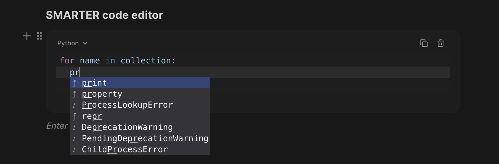
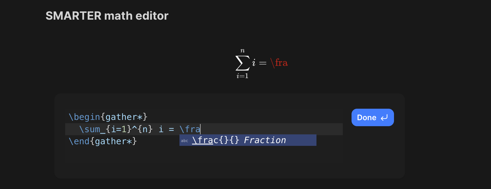
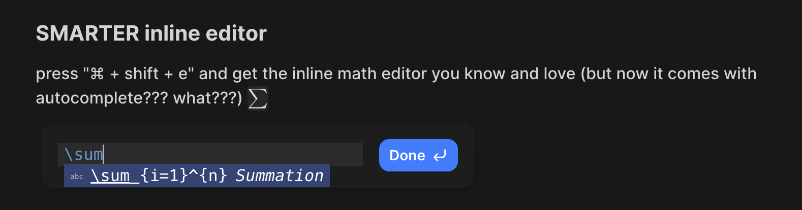

  

# Notoria

**Notoria** is a powerful, Notion-style, block-based editor reimagined for the age of intelligent tooling. It combines the familiarity of a rich text editor with advanced AI features, giving users an intuitive space to write, code, reason, and collaborate. All in one place.

  

Our mission is to 10x your workflow without you having to sacrifice anything from switching over.
If you never have to type more than a few words, then we know we did our job!

## Features

What makes this better than Notion or any other block-based editor? It enhances core features users use time and time again to really maximize efficiency.

### Better Code Editor

You get a nicer typing experience in a code editor that's meant for code. It's not just a monospaced font with syntax highlighting.
There's AI debugging, AI autocomplete, and AI suggestions based on your document and uploaded context (coming soon!).

  

### Better Math Editing

If I have to close any more curly braces manually when trying to type \frac{}{}, I might lose my mind. That's why there's autocomplete with
our LaTeX math blocks too. And you guessed it; AI autocomplete and AI proof-checking is included (coming soon!).

  

  

### Coming Soon

**AI. Lots of it.**

- An AI chat assistant fed with context about your project/assignment/course for whether you need help writing, brainstorming, or debugging
- AI autocomplete. You start the idea, let AI finish it.
- Math proof validations where AI can verify them or help guide you through each logical step.
- Write code blocks and instantly validate logic and correctness with an integrated AI review system.
